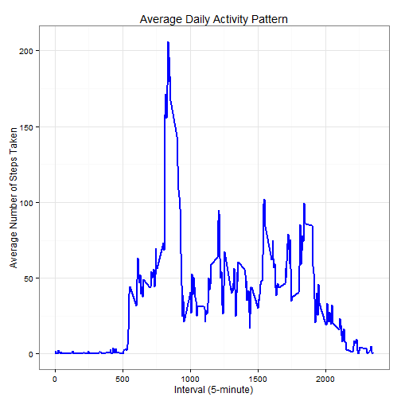

Reproducible Research Peer Assessment 1
=======================================

#### Loading library and data


```r
library(data.table)
library(ggplot2)
library(knitr)
opts_chunk$set(echo = TRUE, results = 'hold')

unzip(zipfile="./repdata-data-activity.zip")
data <- read.csv("activity.csv")

data$date <- as.Date(data$date, format = "%Y-%m-%d")
data$interval <- as.factor(data$interval)
```
## What is mean total number of steps taken per day?

For this part of the assignment, you can ignore the missing values in the dataset.
1. Make a histogram of the total number of steps taken each day


```r
StepsPerDay <- aggregate(steps ~ date, data, sum)
colnames(StepsPerDay) <- c("date","steps")
head(StepsPerDay)

ggplot(StepsPerDay, aes(x = steps)) + 
       geom_histogram(fill = "green", binwidth = 1000) + 
        labs(title="Total Number of Steps Taken Each Day", 
             x = "Number of Steps per Day", y = "Frequency per Day") + theme_bw() 
```

 

```
##         date steps
## 1 2012-10-02   126
## 2 2012-10-03 11352
## 3 2012-10-04 12116
## 4 2012-10-05 13294
## 5 2012-10-06 15420
## 6 2012-10-07 11015
```

2. Calculate and report the mean and median total number of steps taken per day


```r
mean(StepsPerDay$steps, na.rm=TRUE)
median(StepsPerDay$steps, na.rm=TRUE)
```

```
## [1] 10766.19
## [1] 10765
```
Mean: 10766; Median: 10765

## What is the average daily activity pattern?

1. Make a time series plot (i.e. type = "l") of the 5-minute interval (x-axis) and the average number of steps taken, averaged across all days (y-axis)


```r
StepsPerInterval <- aggregate(data$steps, 
                                by = list(interval = data$interval),
                                FUN=mean, na.rm=TRUE)
#convert to integers

StepsPerInterval$interval <- 
        as.integer(levels(StepsPerInterval$interval)[StepsPerInterval$interval])
colnames(StepsPerInterval) <- c("interval", "steps")

ggplot(StepsPerInterval, aes(x=interval, y=steps)) +   
        geom_line(color="blue", size=1) +  
        labs(title="Average Daily Activity Pattern", x="Interval (5-minute)", y="Average Number of Steps Taken") +  
        theme_bw()
```

 

2. Which 5-minute interval, on average across all the days in the dataset, contains the maximum number of steps?


```r
StepsPerInterval[which.max(StepsPerInterval$steps),]
```

```
##     interval    steps
## 104      835 206.1698
```
Interval: 835; Max steps: 206

## Imputing missing values

Note that there are a number of days/intervals where there are missing values (coded as NA). The presence of missing days may introduce bias into some calculations or summaries of the data.

1. Calculate and report the total number of missing values in the dataset (i.e. the total number of rows with NAs)


```r
sum(is.na(data$steps))
```

```
## [1] 2304
```

2. Devise a strategy for filling in all of the missing values in the dataset. The strategy does not need to be sophisticated. For example, you could use the mean/median for that day, or the mean for that 5-minute interval, etc.
3. Create a new dataset that is equal to the original dataset but with the missing data filled in.


```r
naFill <- function(data, pervalue) {
        naIndex <- which(is.na(data$steps))
        naReplace <- unlist(lapply(naIndex, FUN=function(idx){
                interval = data[idx,]$interval
                pervalue[pervalue$interval == interval,]$steps
        }))
        fill_steps <- data$steps
        fill_steps[naIndex] <- naReplace
        fill_steps
}

DataFill <- data.frame(  
        steps = naFill(data, StepsPerInterval),  
        date = data$date,  
        interval = data$interval)
str(DataFill)

FillStepsPerDay <- aggregate(steps ~ date, DataFill, sum)
colnames(FillStepsPerDay) <- c("date","steps")
```

```
## 'data.frame':	17568 obs. of  3 variables:
##  $ steps   : num  1.717 0.3396 0.1321 0.1509 0.0755 ...
##  $ date    : Date, format: "2012-10-01" "2012-10-01" ...
##  $ interval: Factor w/ 288 levels "0","5","10","15",..: 1 2 3 4 5 6 7 8 9 10 ...
```

4. Make a histogram of the total number of steps taken each day and Calculate and report the mean and median total number of steps taken per day. Do these values differ from the estimates from the first part of the assignment? What is the impact of imputing missing data on the estimates of the total daily number of steps?


```r
## Plot
ggplot(FillStepsPerDay, aes(x = steps)) + 
       geom_histogram(fill = "green", binwidth = 1000) + 
        labs(title="Total Number of Steps Taken Each Day", 
             x = "Number of Steps per Day", y = "Frequency per Day") + theme_bw() 
```

 

```r
## Calculate
mean(FillStepsPerDay$steps, na.rm=TRUE)
median(FillStepsPerDay$steps, na.rm=TRUE)
```

```
## [1] 10766.19
## [1] 10766.19
```
Mean after filling in missing values: 10766.19
Median after filling in missing values: 10766.19

The values differ slightly after filling in missing values. Mean and Median after filling in the missing values are equal.

Impact: Mean remains unchange, while median increased and matched with mean. Peak seemed to increase after inputing missing values.

## Are there differences in activity patterns between weekdays and weekends?

For this part the weekdays() function may be of some help here. Use the dataset with the filled-in missing values for this part.

1. Create a new factor variable in the dataset with two levels -- "weekday" and "weekend" indicating whether a given date is a weekday or weekend day.


```r
weekdays_steps <- function(data) {
    weekdays_steps <- aggregate(data$steps, by=list(interval = data$interval),
                          FUN=mean, na.rm=TRUE)
    # convert to integers for plotting
    weekdays_steps$interval <- 
            as.integer(levels(weekdays_steps$interval)[weekdays_steps$interval])
    colnames(weekdays_steps) <- c("interval", "steps")
    weekdays_steps
}

data_by_weekdays <- function(data) {
    data$weekday <- 
            as.factor(weekdays(data$date)) # weekdays
    weekend_data <- subset(data, weekday %in% c("Saturday","Sunday"))
    weekday_data <- subset(data, !weekday %in% c("Saturday","Sunday"))

    weekend_steps <- weekdays_steps(weekend_data)
    weekday_steps <- weekdays_steps(weekday_data)

    weekend_steps$dayofweek <- rep("weekend", nrow(weekend_steps))
    weekday_steps$dayofweek <- rep("weekday", nrow(weekday_steps))

    data_by_weekdays <- rbind(weekend_steps, weekday_steps)
    data_by_weekdays$dayofweek <- as.factor(data_by_weekdays$dayofweek)
    data_by_weekdays
}

data_weekdays <- data_by_weekdays(DataFill)
```


2. Make a panel plot containing a time series plot (i.e. type = "l") of the 5-minute interval (x-axis) and the average number of steps taken, averaged across all weekday days or weekend days (y-axis). The plot should look something like the following, which was created using simulated data:


```r
ggplot(data_weekdays, aes(x=interval, y=steps)) + 
        geom_line(color="green") + 
        facet_wrap(~ dayofweek, nrow=2, ncol=1) +
        labs(x="Interval", y="Number of steps") +
        theme_bw()
```

 

Weekday has the greatest peak from all steps intervals and weekends activities has more peaks over a hundred than weekday. Weekend has better distribution of effort along the time. 
